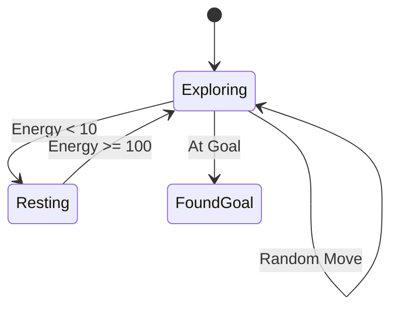
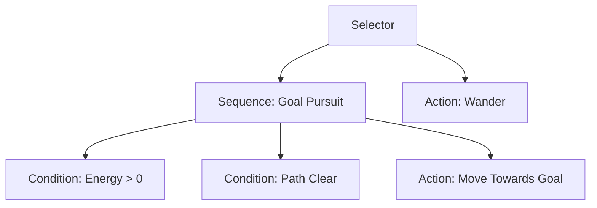

# Cognitive Grid 🧠

[](https://opensource.org/licenses/MIT)
[]()
[](https://bevyengine.org/)

**Cognitive Grid** is a research-grade multi-agent simulation framework designed to benchmark AI architectures under realistic cognitive constraints. It allows researchers to visualize how **Bounded Rationality**, **Spatial Memory**, and **Decision Noise** affect navigation performance in dynamic environments.

---

## 📖 Table of Contents
- [Overview](#-overview)
- [Key Features](#--key-features)
- [Agent Architectures](#-agent-architectures)
- [Cognitive Model](#-cognitive-model)
- [Installation & Usage](#-installation--usage)
- [Controls & Visualization](#-controls--visualization)
- [Project Architecture](#-project-architecture)
- [Configuration](#-configuration)

---

## 🔭 Overview

Traditional pathfinding simulations often assume perfect agents with infinite memory and optimal decision-making. **Cognitive Grid** challenges this by introducing biological plausibility:

1.  **Imperfect Information**: Agents cannot see the entire map's path at once (Bounded Rationality).
2.  **Stochasticity**: Agents make mistakes or get distracted (Decision Noise).
3.  **Forgetting**: Agents only remember a limited history of visited locations (Spatial Memory).

This framework compares three classic AI paradigms—**Reactive (FSM)**, **Deliberative (A*)**, and **Hierarchical (BT)**—to see which is most robust under these constraints.

---

## ✨ Key Features

-   **⚡ High-Performance Engine**: Custom Rust-based grid world with spatial hashing.
-   **🎮 Interactive 3D Viewer**: Built with [Bevy](https://bevyengine.org/) and [egui](https://github.com/emilk/egui).
-   **🧠 Modular AI**: Trait-based agent system allowing easy addition of new architectures.
-   **📉 Data Export**: Headless mode for batch experiments with CSV logging (`episode_logs.csv`).
-   **🔥 Heatmaps**: Real-time visualization of agent exploration patterns.

---

## � Agent Architectures

### 1. Finite State Machine (FSM) 🟢
The baseline agent. purely reactive and state-based. It wanders randomly until it "smells" the goal or runs low on energy.



### 2. Bounded A* Planner 🔵
A deliberate agent that plans paths but has **limited foresight**.
-   **Algorithm**: A* with Manhattan distance heuristic.
-   **Constraint**: `planning_radius`. It stops searching after $N$ nodes.
-   **Behavior**: If the goal is outside the radius, it moves toward the node with the lowest heuristic cost ($h(n)$) within its horizon.

### 3. Behavior Tree (BT) 🟠
A hierarchical agent that balances reactivity with goal-seeking. It uses a **Selector-Sequence** structure.



---

## � Cognitive Model

We model "intelligence constraints" using three tunable parameters:

### 1. Decision Noise ($\epsilon$)
The probability that an agent ignores its chosen action and moves randomly instead.
$$ P(\text{random}) = \epsilon \times \text{decay\_factor} $$
*Simulates: Distraction, motor control errors.*

### 2. Spatial Memory ($\mathcal{M}$)
A FIFO ring buffer storing the last $K$ visited coordinates. Agents produce a "repulsion force" from these cells to avoid backtracking.
*Simulates: Short-term working memory.*

### 3. Exploration Decay ($\gamma$)
As time passes, the agent becomes less "noisy" and more focused.
$$ \epsilon_{t+1} = \epsilon_t \times \gamma $$
*Simulates: Learning and focus over time.*

---

## � Installation & Usage

### Prerequisites
-   Install [Rust](https://rustup.rs/).

### Interactive Mode (3D Viewer)
Run the simulation with the GUI:
```bash
cargo run --bin viewer
```

### Headless Mode (Batch Experiments)
Run 100 episodes for data collection (no GUI):
```bash
cargo run --bin headless
```

---

## 🎮 Controls & Visualization

| Control | Action |
| :--- | :--- |
| **Speed Slider** | Adjust tick rate from **0.1x** (Debug) to **50x** (Hyper). |
| **Pause/Resume** | Freeze the simulation to inspect state. |
| **Restart** | Reset grid, agents, and obstacles. |
| **Show Heatmap** | Toggle floor colors: <br>🟢 Green: FSM visited<br>🔵 Blue: A* visited<br>🟠 Orange: BT visited<br>🟣 Purple: Overlap |
| **Show Radius** | Toggle the blue ring showing A*'s planning horizon. |

---

## 🏗 Project Architecture

The codebase is organized into a modular workspace:

```
src/
├── agents/             # Agent Implementations
│   ├── fsm.rs          # Finite State Machine logic
│   ├── astar.rs        # Pathfinding logic
│   └── behavior_tree.rs# Behavior Tree nodes
├── engine/             # Core Simulation
│   ├── grid.rs         # Grid state, obstacles, collision
│   └── position.rs     # Coordinate utilities
├── vis/                # Visualization (Bevy)
│   ├── app.rs          # App setup
│   ├── systems.rs      # Simulation loop & rendering
│   └── ui.rs           # Egui panels
└── bin/                # Entry Points
    ├── viewer.rs       # GUI Runner
    └── headless.rs     # CLI Runner
```

---

## ⚙️ Configuration

To tweak simulation parameters, edit the constants in `src/bin/viewer.rs` (for UI defaults) or `src/vis/resources.rs`:

```rust
// Example Configuration
const GRID_W: usize = 12;          // Grid Width
const GRID_H: usize = 8;           // Grid Height
const OBSTACLE_DENSITY: f32 = 0.15; // 15% of map is walls
const MAX_TICKS: u32 = 1000;       // Safety timeout
```

To change Agent parameters (Noise, Memory), modify the `setup` system in `src/vis/app.rs`:

```rust
// (x, y, noise, memory, decay)
self.astar = AStarAgent::with_config(0, 0, Some(30), 0.1, 10, 0.995);
```

---

**Developed for Cognitive Science Research.**
*Maintainer: Armash Ansari*
