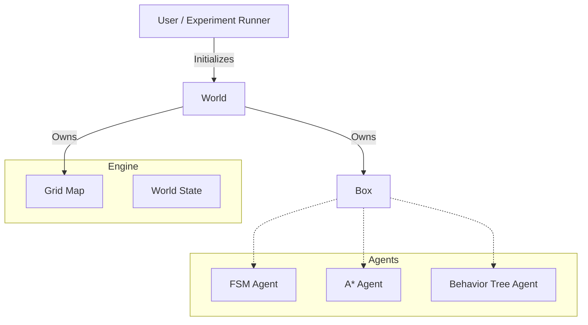
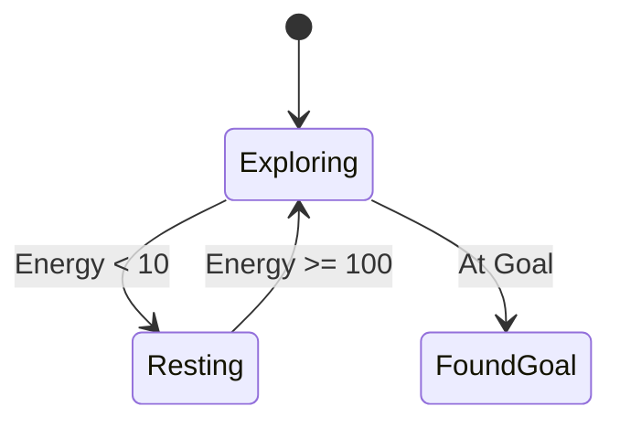
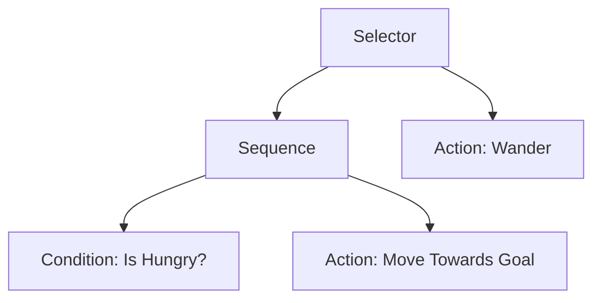

# Cognitive Grid 🧠

**A modular, high-performance 2D grid simulation framework for comparing agent architectures.**


---

## 📖 Overview

**Cognitive Grid** is a research lab for experimenting with structured decision-making in controlled environments. It provides a standardized grid-world engine where different agent architectures—from simple State Machines to complex Behavior Trees—can be implemented, benchmarked, and analyzed under identical conditions.

The framework is designed to answer:
- *How does Agent A compare to Agent B in terms of energy efficiency?*
- *What is the computational cost of planning (A*) vs. reacting (FSM)?*
- *How do Behavior Trees handle dynamic objectives compared to state machines?*

## ✨ Key Features

- **⚡ Lightweight Engine**: Custom 2D grid world with obstacles, goals, and hazards.
- **🤖 Modular Agents**:
  - **Finite State Machines (FSM)**: Deterministic, state-based logic.
  - **A* Pathfinding**: Optimal path planning with Manhattan heuristics.
  - **Behavior Trees (BT)**: Hierarchical, modular decision-making.
- **📊 Metric Logging**: Automated CSV export of steps, energy, and success rates.
- **🧪 Experiment Runner**: Headless batch execution for statistical analysis.

---

## 🏗️ Architecture

The system is built on a strict separation of concerns between the **Engine** (physics/rules) and the **Agents** (decision logic).



### 🧠 Agent Architectures

#### 1. Finite State Machine (FSM)
The FSM agent transitions between discrete states based on energy levels.
- **Exploring**: Moves randomly to find the goal.
- **Resting**: Regenerates energy when low.
- **FoundGoal**: Stops upon reaching the target.



#### 2. A* Pathfinding
The A* agent plans a complete path to the goal at the start.
- **Heuristic**: Manhattan Distance.
- **Re-planning**: Occurs only if the path is blocked (dynamic obstacles).
- **Metric**: Optimality of path length.

#### 3. Behavior Tree (BT)
The BT agent uses a hierarchical tree of nodes to make decisions every tick.
- **Sequence**: `Result = AND(Child1, Child2, ...)`
- **Selector**: `Result = OR(Child1, Child2, ...)`
- **Condition**: Checks state (e.g., `IsHungry?`).
- **Action**: Performs task (e.g., `MoveTowardsGoal`).



---

## 🚀 Getting Started

### Prerequisites
- **Rust**: Latest stable version (Install via [rustup.rs](https://rustup.rs/))

### Installation
```bash
git clone https://github.com/armash66/cognitive-grid-lab.git
cd cognitive-grid-lab
cargo build --release
```

### Running Simulations
You can run individual agent demos to watch them in the terminal:

```bash
cargo run --bin demo_fsm           # Watch FSM Agent
cargo run --bin demo_astar         # Watch A* Agent
cargo run --bin demo_behavior_tree # Watch Behavior Tree Agent
```

---

## 🧪 Experiments

Cognitive Grid includes a powerful batch runner to compare agents statistically.

### Running a Batch
Execute the experiment runner to perform 50 episodes for each agent type:

```bash
cargo run --bin run_experiments
```

### Analyzing Results
Results are saved to `experiments/data/<timestamp>_results.csv`.

**CSV Columns:**
| Column | Description |
|--------|-------------|
| `agent_type` | FSM, AStar, or BehaviorTree |
| `steps` | Total discrete steps taken to reach the goal |
| `energy_remaining` | Energy left at the end of the episode |
| `success` | `true` if goal reached, `false` if max steps exceeded |

---

## 🤝 Contributing

Contributions are welcome! Whether it's adding a new agent architecture (e.g., Reinforcement Learning), improving the heuristic function, or visualizing the simulation, feel free to open a PR.

1. Fork the repository
2. Create your feature branch (`git checkout -b feature/amazing-agent`)
3. Commit your changes (`git commit -m 'Add AmazingAgent'`)
4. Push to the branch (`git push origin feature/amazing-agent`)
5. Open a Pull Request

## 📄 License

This project is open source and available under the [MIT License](LICENSE).
