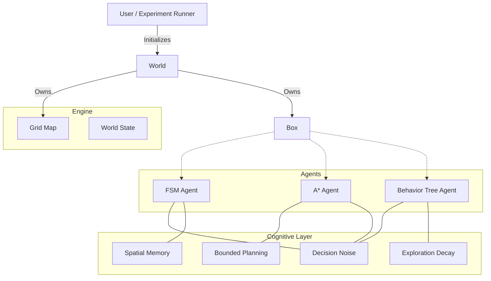
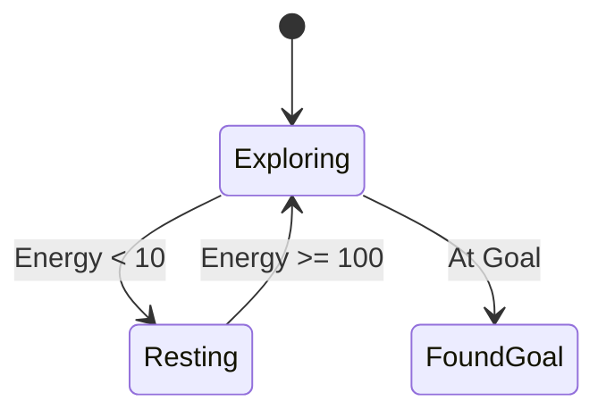
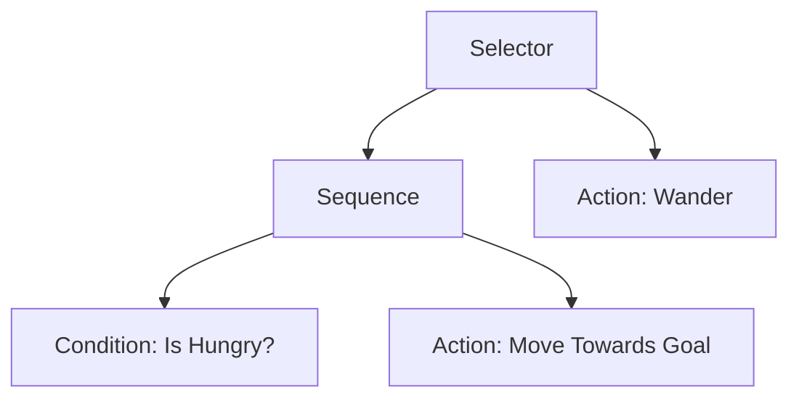

# Cognitive Grid 🧠

**A modular, high-performance 2D grid simulation framework for comparing agent architectures under cognitive constraints.**


---

## 📖 Overview

**Cognitive Grid** is a research lab for experimenting with structured decision-making in controlled environments. It provides a standardized grid-world engine where different agent architectures—from simple State Machines to complex Behavior Trees—can be implemented, benchmarked, and analyzed under identical conditions.

The framework goes beyond simple pathfinding by adding **cognitive limitations** that simulate bounded rationality, making agent behavior more realistic:
- **Decision Noise** — agents randomly deviate from optimal actions
- **Bounded Planning** — A* search caps node expansions, yielding partial paths
- **Spatial Memory** — agents track visited cells with finite ring-buffer memory
- **Exploration Decay** — noise probability decays over time as agents "learn"

## ✨ Key Features

- **⚡ Lightweight Engine**: Custom 2D grid world with obstacles and goals.
- **🤖 Three Agent Architectures**: FSM, A* Pathfinding, and Behavior Trees.
- **🧠 Cognitive Layer**: Noise, bounded planning, spatial memory, exploration decay.
- **📊 Structured Logging**: CSV export of steps, energy, and all cognitive parameters.
- **🧪 Experiment Sweeps**: Batch runner sweeping noise, planning limits, memory, and decay.
- **🎮 3D Visualization**: Real-time Bevy viewer with color-coded agents and trail dots.

---

## 🏗️ Architecture



### 🧠 Agent Architectures

#### 1. Finite State Machine (FSM)
Transitions between discrete states based on energy levels.



#### 2. A* Pathfinding
Plans a path to the goal using Manhattan distance heuristic.
- **Bounded rationality**: `planning_limit` caps node expansions, producing partial paths.
- **Re-planning**: Triggers when path is exhausted or noise invalidates it.

#### 3. Behavior Tree (BT)
Hierarchical tree of Selector/Sequence/Action/Condition nodes.



### 🧩 Cognitive Parameters

| Parameter | Field | Affects | Description |
|-----------|-------|---------|-------------|
| Decision Noise | `noise: f32` | All agents | Probability of taking a random move |
| Bounded Planning | `planning_limit: Option<usize>` | A* only | Max node expansions per search |
| Spatial Memory | `memory_capacity: usize` | All agents | Ring-buffer of visited cells (FIFO eviction) |
| Exploration Decay | `decay_rate: f32` | All agents | Per-tick multiplier on effective noise |

---

## 🚀 Getting Started

### Prerequisites
- **Rust**: Latest stable version (Install via [rustup.rs](https://rustup.rs/))

### Installation
```bash
git clone https://github.com/armash66/cognitive-grid-lab.git
cd cognitive-grid-lab
cargo build --release
```

### Running Simulations

```bash
# Terminal demos
cargo run --bin demo_fsm           # FSM Agent
cargo run --bin demo_astar         # A* Agent
cargo run --bin demo_behavior_tree # Behavior Tree Agent

# Headless runner (all agents, no delay)
cargo run --bin headless

# 3D Viewer (Bevy)
cargo run --bin viewer
```

### 🎮 3D Viewer

The Bevy viewer shows all three agents navigating the grid simultaneously:

| Element | Visual |
|---------|--------|
| 🟢 FSM | Green cube |
| 🔵 A* | Blue cube |
| 🟠 BT | Orange cube |
| 🟡 Goal | Golden rotating cylinder |
| Trail | Translucent breadcrumb spheres |

Agents disappear when they reach the goal. Console prints a summary with tick counts.

---

## 🧪 Experiments

### Running Parameter Sweeps
```bash
cargo run --bin run_experiments
```

Runs 4 sweeps across all agent types (100 episodes each):

| Sweep | Values |
|-------|--------|
| Noise | 0.0, 0.1, 0.3, 0.5 |
| Planning Limit (A*) | None, 50, 20, 5 |
| Memory Capacity | 0, 5, 20, 100 |
| Decay Rate | 1.0, 0.99, 0.95 (noise=0.5) |

### CSV Output
Results saved to `experiments/data/<timestamp>_results.csv`.

| Column | Description |
|--------|-------------|
| `agent_type` | FSM, AStar, or BehaviorTree |
| `steps` | Steps taken to reach goal |
| `success` | Whether goal was reached |
| `energy_remaining` | Energy at end of episode |
| `noise` | Noise probability used |
| `planning_limit` | A* expansion cap (0 = unlimited) |
| `memory_capacity` | Memory ring-buffer size |
| `decay_rate` | Per-tick exploration decay |

---

## 🤝 Contributing

Contributions welcome! Ideas:
- New agent architectures (RL, MCTS)
- Dynamic obstacles / multi-agent scenarios
- Web-based visualization
- Statistical analysis tooling

1. Fork → branch → commit → PR.

## 📄 License

This project is open source and available under the [MIT License](LICENSE).
